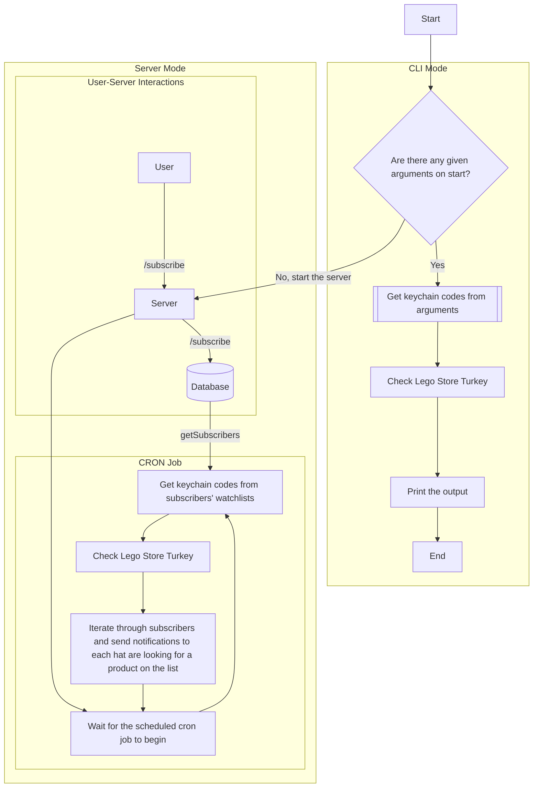
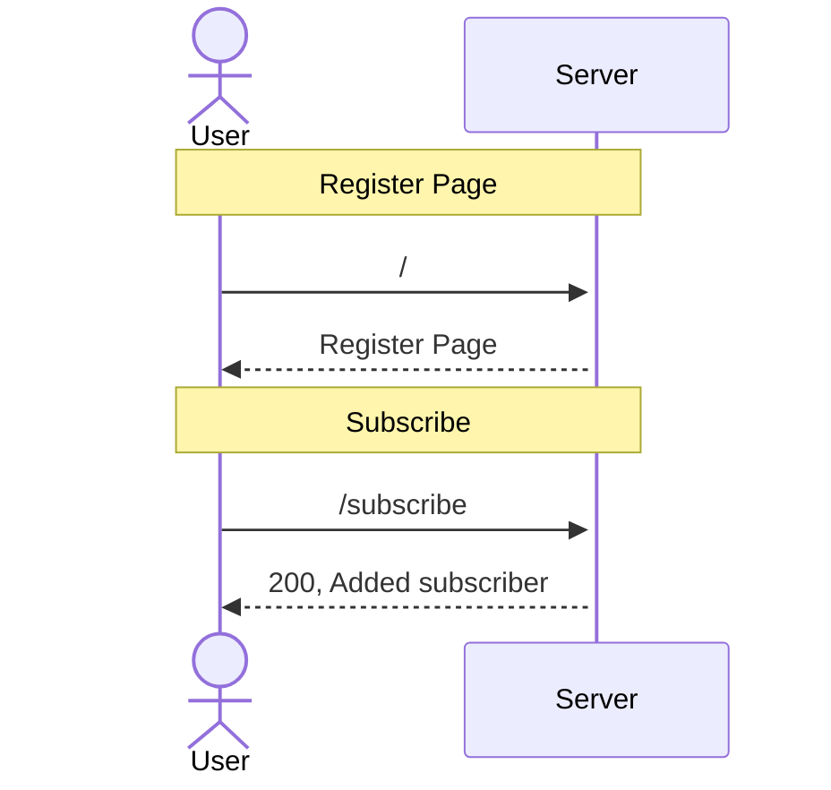
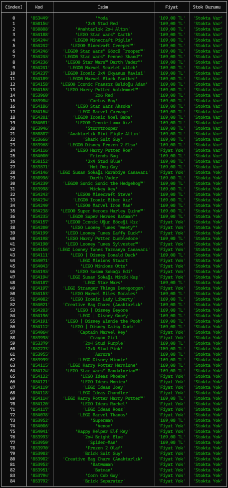
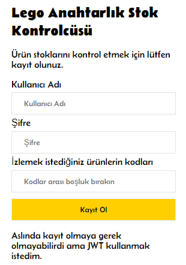

# Lego Store Stock Checker
This project is made to check the stock of Lego Store Turkey, it offers two modes:
1. CLI mode, which works by looking for keychains that are given as arguments when starting the project.
2. Server mode, which works by checking keychains and sending push notifications using webpush to users (subscribers) which are registered using `/subscribe` endpoint and being stored in an sqlite database.

## Tech Stack
[](https://skillicons.dev)

### Flowchart

### Server and User Interaction


## Özellikler
- [CLI Mode](https://github.com/yussufbiyik/lego-store-stock-checker?tab=readme-ov-file#using-cli)
- [Server Mode](https://github.com/yussufbiyik/lego-store-stock-checker?tab=readme-ov-file#using-as-a-server)
    - Scheduled cron jobs to check the stock in regular intervals
        - Sending push notifications if a product is in stock
    - Multiple user support
        - Safe password storage & Authentication

## Setup
1. Clone or download the project.
2. Open the project directory in terminal.
3. Run `npm install` command and download the project dependencies.
4. Only required for server mode, create a file named `.env`, this will store our secrets.

### Creating VAPID Keys
Run
```bash
$ npm run createVAPID
```
command on terminal al save the response, the `PUBLIC_VAPID_KEY` and `PRIVATE_VAPID_KEY` values in `.env` comes from here.

### Creating .env File
```env
# WEBPUSH CONFIG
PUBLIC_VAPID_KEY="Public VAPID Key" 
PRIVATE_VAPID_KEY="Private VAPID Key"
MAIL="Your E-Mail"
# JWT CONFIG
TOKEN_SECRET="Random secret code that should not be shared, type whateveer you want to."
# SERVER CONFIG
PORT=3000
# Interval of the CRON Job
CRON_INTERVAL = "0 */4 * * *"
```
Change all the values.

## Using as a Server
Watchlist is constructed by itrating over all users and pushing their watchlist to an array and flattening it later.

The way the cron job is scheduled is assigned to CRON_INTERVAL in the `.env` file, [Refer](https://www.npmjs.com/package/node-cron#cron-syntax) to here to change thee interval as you wish.
Default is once every 4 hours. 

Run
```bash
$ npm start
``` 
command on terminal to start the server.

### Registering to the Server
You'll be greeted by the register page if you visit `localhost:PORT`*, you can register with any username and password and make sure to fill the form with your watchlist.

*: PORT, is determined in `.env` file, default is 3000

## Using CLI
If you don't want need scheduled checks, just use this in the following format (pass 0 as keychain code to get all the keychains):
```bash
$ npm start <KEYCHAIN_CODE> <KEYCHAIN_CODE>
``` 

## LISENCE
ISC

## TODOs
- [X] Stok oldukça cihaza bildirim gönderme
- [X] JWT ile ~~sadece sunucuyu kuran kişinin servise erişmesini~~ çoklu kullanıcı erişimi sağlama (aslında hiç gerek yok da, JWT kullanmak istedim.)
- [X] Dotenv ile önemli bilgilerin gizliliğini sağlama
- [ ] Firebase üzerinde çalıştırılabilecek hale getirme
- [X] readme dosyasında kullanım üzerine daha fazla detay verme

## Screenshots

