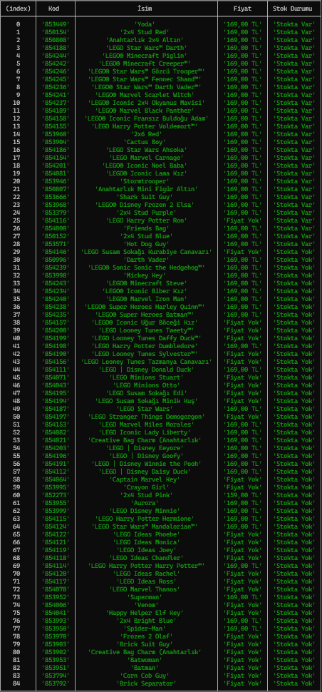

# Lego Store Stok Kontrolcüsü
Bu proje, belirli Lego anahtarlıklarının stok durumunu kontrol etmek için oluşturulmuştur. Proje, belirli aralıklarla Lego Store Türkiye'nin web sitesini kontrol eder ve belirli anahtarlıkların stok durumunu kontrol eder.

## Nasıl Çalışır?
...

## Kurulum
Projenin kurulumu için aşağıdaki adımları takip edebilirsiniz:

1. Projeyi klonlayın veya indirin.
2. Terminalde proje klasörüne gidin.
3. ```npm install``` komutunu çalıştırın. projenin çalışması için gerekli olan paketler yüklenecektir.

## Kullanım
Proje, ```config.json``` dosyasında belirtilen ya da argüman olarak verilen anahtarlık kodlarını kontrol eder. Eğer kod olarak 0 girilirsee tüm ürünleri kontrol eder.

Kontrol edilecek anahtarlıkların listesi config.json dosyasında watchlist olarak belirtilmiştir.

Proje, belirli aralıklarla kontrol yapar. Bu aralık config.json dosyasında checkIntervalAsCron olarak belirtilmiştir ve cron formatında olmalıdır. Varsayılan olarak her 4 saatte bir çalışır.

Proje, izleme listesini sürekli kontrol etmek için: 
```bash
$ npm start
``` 
komutu ile çalıştırılabilir.

Eğer sadece belirli ürünlere bakmak istiyorsanız:
```bash
$ node index.js <ANAHTARLIK_KODU> <ANAHTARLIK_KODU>
```
şeklinde istediğiniz kadar anahtarlık kodu girilerek çalıştırılabilir. 

## Lisans
Bu proje ISC lisansı ile lisanslanmıştır.

## Yapılacaklar
- [X] Stok oldukça cihaza bildirim gönderme
- [ ] JWT ile sadece sunucuyu kuran kişinin servise erişmesini sağlama
- [ ] Dotenv ile önemli bilgilerin gizliliğini sağlama
- [ ] Firebase üzerinde çalıştırılabilecek hale getirme
- [ ] readme dosyasında kullanım üzerine daha fazla detay verme

## Ekran Görüntüleri


