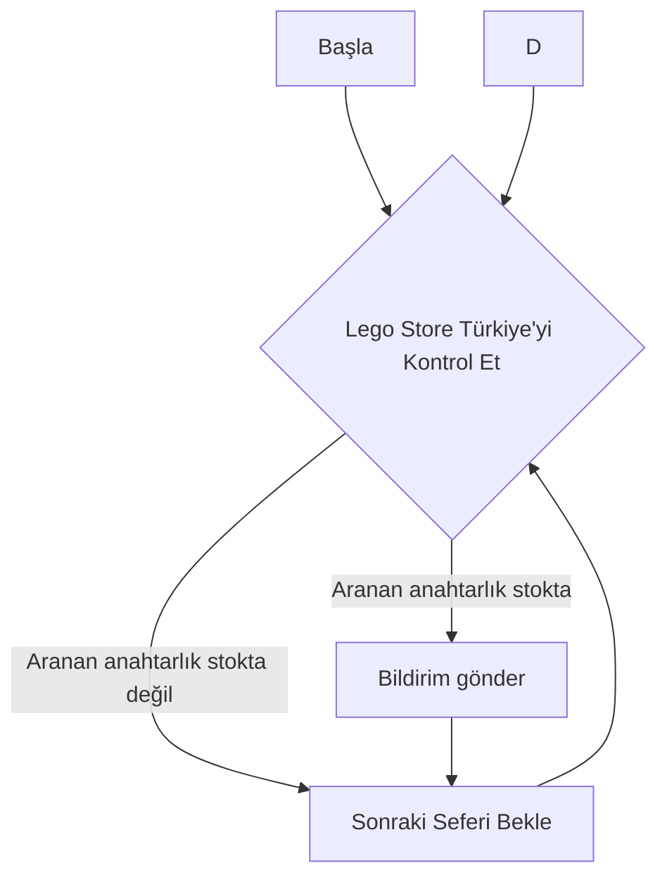

# Lego Store Stok Kontrolcüsü
Bu proje, belirli Lego anahtarlıklarının stok durumunu kontrol etmek için oluşturulmuştur. Proje, belirli aralıklarla Lego Store Türkiye'nin web sitesini kontrol eder ve belirli anahtarlıkların stok durumunu kontrol eder.

## Kullanılan Teknolojiler
[](https://skillicons.dev)

## Nasıl Çalışır?


## Özellikler
- [CLI ile kullanım](https://github.com/yussufbiyik/lego-store-stock-checker?tab=readme-ov-file#Tek%20Seferlik%20Kullan%C4%B1m%20%28CLI%29)
- [Sunucu olarak kullanım](https://github.com/yussufbiyik/lego-store-stock-checker?tab=readme-ov-file#Sunucu%20Olarak%20Kullan%C4%B1m)
    - Belirli aralıklarla stok kontrol etme
        - Stok olunca bildirim gönderme
    - Birden fazla kullanıcı desteği
        - Güvenli şifre saklama (JWT)

## Kurulum
Projenin kurulumu için aşağıdaki adımları takip edebilirsiniz:

1. Projeyi klonlayın veya indirin.
2. Terminalde proje klasörüne gidin.
3. ```npm install``` komutunu çalıştırın. projenin çalışması için gerekli olan paketler yüklenecektir.
4. Sadece sunucu modu için gerekli! Bir sonraki başlığı takip edin ve `.env` dosyasını oluşturun.

### Vapid Key Oluşturma
Terminalde
```bash
$ npm run createVAPID
```
komutunu çalıştırın ve çıktıyı kaydedin, .env dosyasında bildirim göndermek için lazım olacak.

### .env Dosyası Oluşturma
```env
# WEBPUSH CONFIG
PUBLIC_VAPID_KEY="Public VAPID Key" 
PRIVATE_VAPID_KEY="Private VAPID Key"
MAIL="E-Postanız"
# JWT CONFIG
TOKEN_SECRET="JWT için paylaşılmaması gereken bir kod, kafanıza göre bir metin yazın."
# SERVER CONFIG
PORT=3000
# Sunucunun kontrol aralığı (node-cron'un istediği formatta olmalı)
CRON_INTERVAL = "0 */4 * * *"
```

## Sunucu Olarak Kullanım
Kontrol edilecek anahtarlıkların listesi argüman olarak verilir, eğer verilmezse sunucu çalışır ve izleme listesi kullanıcıların izleme listesi baz alınarak oluşturulur.

Kontrol sıklığı .env dosyasında CRON_INTERVAL olarak belirtilmiştir, [Buraya](https://www.npmjs.com/package/node-cron#cron-syntax) bakarak istediğiniz sıklığı ayarlayabilirsiniz.
Varsayılan 4 saatte bir kontrol etmektir. 

Sunucu 
```bash
$ npm start
``` 
komutu ile çalıştırılabilir.

### Sunucuya Kayıt Olmak
`localhost:PORT`* adresini ziyaret ederseniz ana sayfa ile karşılaşacaksınız, buradan herhangi bir isim ve şifre ile kaydolabilirsiniz, isim ve şifrenin bir önemi yok tamamken keyfi olarak ekledim.

*: PORT, .env dosyasında belirlenir, belirlenmezse varsayılan port 3000'dir

## Tek Seferlik Kullanım (CLI)
Eğer sadece belirli ürünlere bakmak istiyorsanız (her ürünü kontrol için anahtar kodu olarak 0 yazmalısınız) terminale:
```bash
$ npm start <ANAHTARLIK_KODU> <ANAHTARLIK_KODU>
```
formatında komutunuzu yazarak istediğiniz kadar anahtarlık koduna bakabilirsiniz. 

## Lisans
Bu proje ISC lisansı ile lisanslanmıştır.

## Yapılacaklar
- [X] Stok oldukça cihaza bildirim gönderme
- [X] JWT ile ~~sadece sunucuyu kuran kişinin servise erişmesini~~ çoklu kullanıcı erişimi sağlama (aslında hiç gerek yok da, JWT kullanmak istedim.)
- [X] Dotenv ile önemli bilgilerin gizliliğini sağlama
- [ ] Firebase üzerinde çalıştırılabilecek hale getirme
- [X] readme dosyasında kullanım üzerine daha fazla detay verme

## Ekran Görüntüleri

